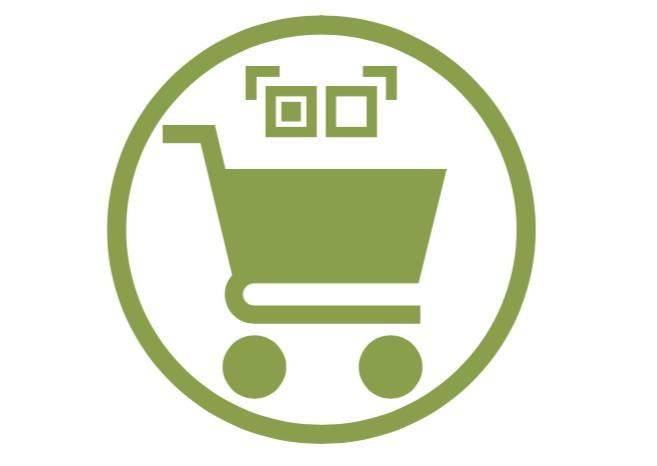
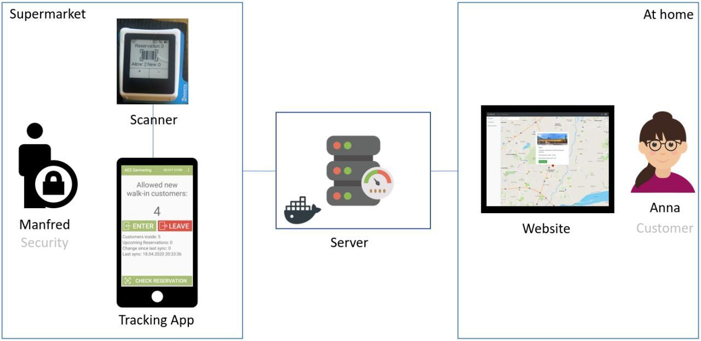

# qr-cart

Winner of hackaTUM C0dev1d19 (COVID19-Edition)

## Idea

In times of Corona social distancing is key. We want to eliminate unnecessary queues in front of supermarkets & regulate the number of people in stores.

To achieve this, we presenr QR-Cart. A full fletched reservation & ticketing system that at the same time allows customers without reservation to fully maximize a store's legally allowed capacity during this time.

## Demo

A demo of the website is available at http://andromeda.goma-cms.org:1338/

To run the mobile app, go to the mobile subfolder and build the project.

## Project Structure

The three components (backend, frontend, mobile) have their respective subfolders containing the source code and instructions for local development.

## Team

- Mobile: [Daniel Gruber](https://www.linkedin.com/in/daniel-gruber-6758a2139/)
- System & Design: [Johannes Schleicher](https://www.linkedin.com/in/johannes-schleicher/)
- Frontend: [Gilles Tanson](https://www.linkedin.com/in/gilles-tanson-638b46113/)
- Backend: [Jonathan Rösner](https://github.com/jonrosner)
